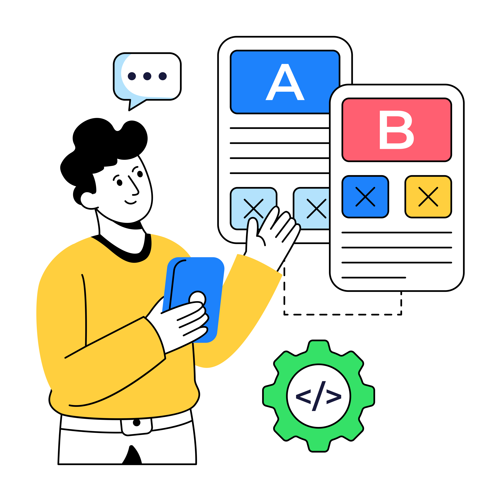

# Journey Optimizer Experimentation Accelerator 

>[!AVAILABILITY]
>
>**Journey Optimizer Experimentation Accelerator** requires a paid license for customers and integrates seamlessly with either Adobe Target or Adobe Journey Optimizer.

The **Journey Optimizer Experimentation Accelerator** is a powerful tool designed to streamline and enhance the experimentation process. By integrating with Adobe Target and Adobe Journey Optimizer, it provides a centralized platform for managing, analyzing, and optimizing experiments. Leveraging AI-driven insights and adaptive testing, the Journey Optimizer Experimentation Accelerator empowers you to make data-driven decisions, improve marketing strategies, and drive measurable results.

Key benefits include:

* **Faster Experimentation**: Run adaptive, always-on tests with models that adjust over time.
* **Unified Platform**: Manage all experiments from Adobe Target and Journey Optimizer in one place.
* **AI-Driven Insights**: Automatically surface key findings, performance drivers, and new opportunities.
* **Smarter Targeting**: Use behavioral and content data to prioritize high-impact experiments.
* **KPI Monitoring**: Track metrics like lift and confidence across experiments.
* **Seamless Collaboration**: Share results easily and manage team roles with real-time alerts.

<table style="table-layout:fixed">
<tr style="border: 0; text-align: center;">
<td> <a href="../start/experiment-accelerator-access.md">Get started with the Journey Optimizer Experimentation Accelerator</a></td>
<td> <a href="../start/experiment-accelerator-best-practices.md">Journey Optimizer Experimentation Accelerator best practices</a></td>
<td> <a href="../track/experiment-accelerator-monitor.md">Track and monitor the performance of your experiments</a></td>
</tr>
</table>
