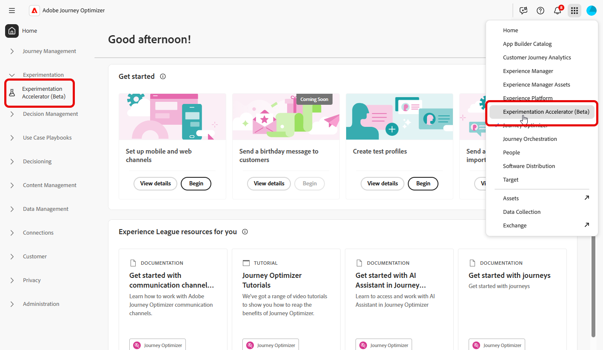
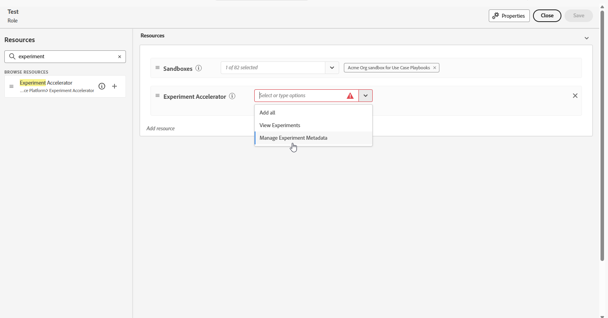

# Access Journey Optimizer Experimentation Accelerator

After [creating and configuring your experiment](https://experienceleague.adobe.com/en/docs/journey-optimizer/using/content-management/content-experiment/content-experiment) and sending your campaigns or journeys to your profiles, you can access the **[!UICONTROL Journey Optimizer Experimentation Accelerator]** to dive deeper into how your experiment is performing.

You can access **[!UICONTROL Journey Optimizer Experimentation Accelerator]** either from the left-hand menu from the [!UICONTROL Experimentation] drop-down or via the Apps switcher. Note that users with only a Target license can access it only through the Apps switcher.

Available experiments depend on your setup:

* **For Adobe Journey Optimizer users**: Experiments set up in your enabled organisation's sandbox are automatically included.

* **For Adobe Target users with Journey Optimizer**: Any A/B activities in Target appear in **[!UICONTROL Journey Optimizer Experimentation Accelerator]** in the production sandbox of Journey Optimizer.

* **For Adobe Target-only users**: All A/B activities in your Target organization are included in the production sandbox of Journey Optimizer.

To use **[!UICONTROL Journey Optimizer Experimentation Accelerator]**, you need access to the sandbox and following related permission:

* **[!UICONTROL View Experiments]**
* **[!UICONTROL Manage Experiment Metada]**

+++ Learn how to assign Experiment related permissions

1. In the **[!DNL Permissions]** product, go to the **[!UICONTROL Roles]** tab and select the desired **[!UICONTROL Role]**.

1. Click **[!UICONTROL Edit]** to modify the permissions.

1. Add the **[!UICONTROL Experiment accelerator]** resource, then select **[!UICONTROL View Experiments]** and/or **[!UICONTROL Manage Experiment Metada]** from the drop-down menu.

   

1. Click **[!UICONTROL Save]** to apply changes.

Any users already assigned to this role will have their permissions automatically updated.

To assign this role to new users:

1. Navigate to the **[!UICONTROL Users]** tab within the Roles dashboard and click **[!UICONTROL Add User]**.

1. Enter the user's name, email address, or choose from the list, then click **[!UICONTROL Save]**.

    If the user was not previously created, refer to [this documentation](https://experienceleague.adobe.com/en/docs/experience-platform/access-control/abac/permissions-ui/users).

The user will receive an email with instructions to access your instance.

+++

<!--table style="table-layout:fixed"><tr style="border: 0;">
<td>

<strong><a href="experiment-accelerator-overview.md">Overview</a></strong>

</td>
<td>

<strong><a href="experiment-accelerator-monitor.md">Experiments</a></strong>

</td>
<td>

<strong><a href="experiment-accelerator-metrics.md">Metrics</a></strong>

</td>
</tr></table-->
