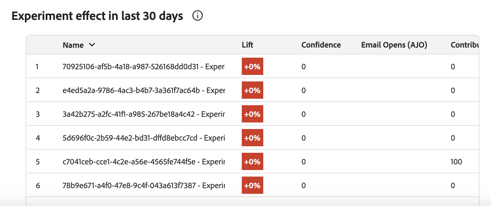

# Metrics {#experiment-accelerator-metrics}

The **[!UICONTROL Metrics]** page displays success metrics from Journey Optimizer and Target experiments in one place, enabling performance monitoring, comparison, and deeper insights.

## Dashboard {#dashboard}

When accessing the **[!UICONTROL Metrics]** tab, all available success metrics from Journey Optimizer and Adobe Target are listed in a consolidated view to help you track performance across initiatives, compare results, and quickly identify areas that require attention.

Access filters by clicking , which offers context-specific options such as filtering by **[!UICONTROL Source]** or **[!UICONTROL Used in active experiments]**.

Alternatively, quickly find any metric by typing its name into the search bar.

## Metric details {#metric-details}

### Incremental over time

The **[!UICONTROL Incremental over time]** chart provides a visual breakdown of how the selected metric is trending across a chosen time range. Use the drop-down menu to toggle between daily or weekly views to adjust the level of granularity.

Following summary values are available for quick reference:

* **[!UICONTROL Total]**: The cumulative value of the selected metric over the reporting period. 

* **[!UICONTROL Average]**: The typical value of the metric calculated across the selected time range. By balancing out daily or weekly fluctuations, it provides a clearer picture of normal performance and can be used as a baseline for comparison.

* **[!UICONTROL Conversion rate]**: Percentage of profiles who completed the desired action (e.g., purchase, sign-up) after seeing the treatment.

Each value includes a percentage change from the previous period, making it easy to see whether performance is improving, declining, or remaining stable.

### Experiment effect

This section displays all active experiments within the selected time frame (Last 90 days, Last 30 days, or Last 7 days) and highlights their contribution to the metric.

Following metrics are available:

* **[!UICONTROL Lift]**: Measure of the percentage improvement in conversion rate of a given treatment over the baseline.

* **[!UICONTROL Confidence]**: Evidence that a given treatment is the same as the baseline treatment. [Learn more](http://experienceleague.adobe.com/en/docs/journey-optimizer/using/content-management/content-experiment/technotes/experiment-calculations)

* **[!UICONTROL Contribution]**: The proportion of the overall change in the metric that can be attributed to a specific experiment or treatment, enabling identification of the initiatives exerting the greatest relative impact.
