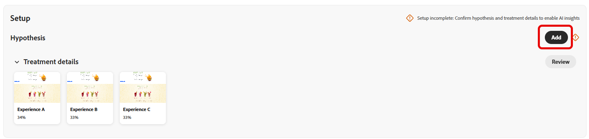
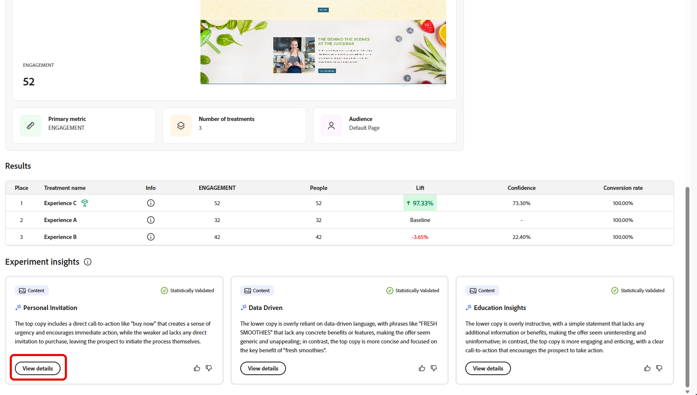

# Track your experiments {#monitor}

The **[!UICONTROL Experiments]** tab centralizes the tracking and analysis of tests from Adobe Journey Optimizer and Adobe Target. You can view all experiments, review KPIs, and filter or search to locate specific tests.

## Dashboard {#dashboard}

When accessing the Experiments tab, all available experiments from Journey Optimizer and Adobe Target are listed in a consolidated view. This allows you to quickly review and compare experiments across both platforms in one place. 
The Experiments list includes:

* Journey Optimizer experiments created in either Campaigns or Journeys.

* Adobe Target experiments available in the Journey Optimizer production default sandbox linked to the same IMS organization.

The KPI section provides key metrics, including the total number of experiments created and the number currently in progress, offering a snapshot of overall experimentation activity

Access filters by clicking , which offers context-specific options such as filtering by **[!UICONTROL Type]**, **[!UICONTROL Starred]**, **[!UICONTROL Status]**, or **[!UICONTROL Source]**. For example, you can filter to show only active experiments from Journey Optimizer.

Alternatively, quickly find your experiment by typing its name into the search bar.

## Monitor your experiments {#monitor-page}

To access and monitor your experiments, select your previously configured experiment from your list of experiments from the **[!UICONTROL Experiments]** tab, or use the advanced menu to **[!UICONTROL View details]** or **[!UICONTROL Open in source]**.

The experiment detail page is split into the following section:

* [Experiment Outcome](#experiment-outcome)
* [Hypothesis](#hypothesis)
* [Details](#details)
* [Opportunities](#opportunities)
* [Results](#results)
* [Experimentation insights](#insights)

### Experiment outcome {#experiment-outcome}

The **[!UICONTROL Experiment outcome]** gives you a quick view of the winning variation in your experiment.

### Set up {#set-up}

The **[!UICONTROL Hypothesis]** captures the planned changes to be tested and documents the expected impact on the primary metric. Defining a clear **[!UICONTROL Hypothesis]** ensures that each experiment has a measurable objective, making it easier to evaluate results and determine whether the changes lead to meaningful improvements.

Note that for [Experiment insights](#insights) to be generated, you need to confirm hypothesis and treatment details and statistical significance to be reached.

1. Click **[!UICONTROL Add]** to create a **[!UICONTROL Hypothesis]** for your experiment. 

   

1. Type-in your **[!UICONTROL Hypothesis]** by detailing changes that was made and how they will impact the primary metric. 

   Click **[!UICONTROL Save]**.

1. Click **[!UICONTROL Review]** to add or replace the image for each Treatment.

   

1. Treatment images are generated automatically, but if needed, you can select **[!UICONTROL Add image]** or **[!UICONTROL Replace image]** to upload a preferred screenshot from your local files for your **[!UICONTROL Treatments]**.

   Note that the screenshot should capture the entire page. 

1. Click  icon to update your **[!UICONTROL Hypothesis]** if needed.

Once you finished configuring your **[!UICONTROL Hypothesis]**, you will to get valuable [Insights](#insights) and [Opportunities](#opportunities). 

### Details {#details}

The **[!UICONTROL Experiment Effect]** widget provides a detailed view of how your experiment influenced the targeted audience segments. It presents key performance indicators that help you assess engagement and behavior, including:

* **[!UICONTROL Success metric]** from Journey Optimizer or the **[!UICONTROL Primary metric]** from Adobe Target depending on what was configured during the experiment creation.

* **[!UICONTROL Visitors]**: The total number of unique visitors exposed to the experiment.

You can also view a real-time snapshot of how the leading treatment is performing through the following metrics:

* **[!UICONTROL Current Leader]**: identifies the treatment currently delivering the best performance.

* **[!UICONTROL Lift Over Baseline]**: measures the percentage improvement of the leading treatment compared to the control or baseline.

* **[!UICONTROL Success metric]** from Journey Optimizer or the **[!UICONTROL Primary metric]** from Adobe Target depending on what was configured during the experiment creation.

At the bottom of the widget, you can find a concise summary of your experiment configuration, including:

* **[!UICONTROL Success metric]** from Journey Optimizer or the **[!UICONTROL Primary metric]** from Adobe Target depending on what was configured during the experiment creation.

* **[!UICONTROL Number of Treatments]**: The total number of variations tested.

* **[!UICONTROL Audience]**: The defined user segment(s) targeted during the experiment.

### Opportunities {#opportunities}

>[!AVAILABILITY]
>
>Opportunities feature is limited to experiments with text-based changes.

The **[!UICONTROL Opportunities]** panel displays AI-generated recommendations designed to enhance test performance and align with broader business objectives and KPIs.

Note that for Experiment opportunities to be generated, you first need to [confirm hypothesis and treatment details](#set-up).

1. Browse through the suggested opportunity and click **[!UICONTROL View Opportunity]**.

   

1. Selecting an opportunity opens the **Opportunity Details** window, which outlines a specific treatment or variation suggested by the Journey Optimizer Experimentation Accelerator. This view includes:

   * **[!UICONTROL Hypothesis]**: An AI-generated hypothesis that explains the expected outcome of the suggested treatment.

   * **[!UICONTROL Rationale]**: An explanation of why the Journey Optimizer Experimentation Accelerator suggested this opportunity. 

   * **[!UICONTROL Opportunity evaluation]**: A dual assessment of the recommendation based on:

      * **[!UICONTROL Learning potential]**: An estimate of how much new insight the opportunity could provide, based on how different it is from what has been tested before.

      * **[!UICONTROL Conversion potential]**: An estimate of how likely the opportunity is to outperform current treatments, based on similarities to strategies that have historically worked well.
   <!--
   * **[!UICONTROL New text treatment example]**: Words or phrases that demonstrate the style the AI recommends using.
   -->

   

1. You can then add it directly to your experiment by selecting **[!UICONTROL Open Experiment]**.

1. If the original experiment was created and managed in Adobe Journey Optimizer, this action will open the **[!UICONTROL Content Experimentation Panel]** within that campaign.

   For experiments originating from **[!DNL Adobe Target]**, the suggested changes will instead be loaded into **[!DNL Adobe Target]**'s experimentation workflow. 
   
   ➡️ [Learn more in Adobe Target documentation](https://experienceleague.adobe.com/en/docs/target/using/activities/abtest/test-ab)

1. Within the experiment view, the same AI **[!UICONTROL Experimentation Opportunities]** surfaced by the Journey Optimizer Experimentation Accelerator are accessible. 

   Select **[!UICONTROL View]** to open the opportunity details.

1. To apply the suggested changes, selecting **[!UICONTROL Modify Experiment]** enables direct editing of the existing experiment.

### Results {#results}

The **[!UICONTROL Results]** table provides a detailed performance breakdown of each treatment within an experiment. These indicators help evaluate effectiveness, user engagement, and overall impact on key business outcomes:

* **[!UICONTROL Place]**: Ranking position of the treatment based on performance indicating how it compares to other treatments.

* **[!UICONTROL Success metric]** from Journey Optimizer or the **[!UICONTROL Primary metric]** from Adobe Target depending on what was configured during the experiment creation.

* **[!UICONTROL People]**: Number of user profiles who qualify as target profiles for your messages.

* **[!UICONTROL Lift]**: Measure of the percentage improvement in conversion rate of a given treatment over the baseline.

* **[!UICONTROL Confidence]**: Evidence that a given treatment is the same as the baseline treatment. [Learn more](http://experienceleague.adobe.com/en/docs/journey-optimizer/using/content-management/content-experiment/technotes/experiment-calculations)

* **[!UICONTROL Conversion rate]**: Percentage of profiles who completed the desired action (e.g., purchase, sign-up) after seeing the treatment.

### Experiment insights {#insights}

>[!AVAILABILITY]
>
>Experimentation Insights feature is limited to experiments with text-based changes.

**[!UICONTROL Experiment Insights]** are AI-generated learnings derived from this experiment. These insights become available once the experiment reaches statistical significance and provide contextual understanding of what contributed to its success. They highlight the key attributes present in the winning treatment, distinct from the control, that likely influenced the outcome.

Note that for Experiment insights to be generated, you first need to [confirm hypothesis and treatment details](#set-up) and statistical significance to be reached.

Click **[!UICONTROL View details]** to learn more on each insights.

 

